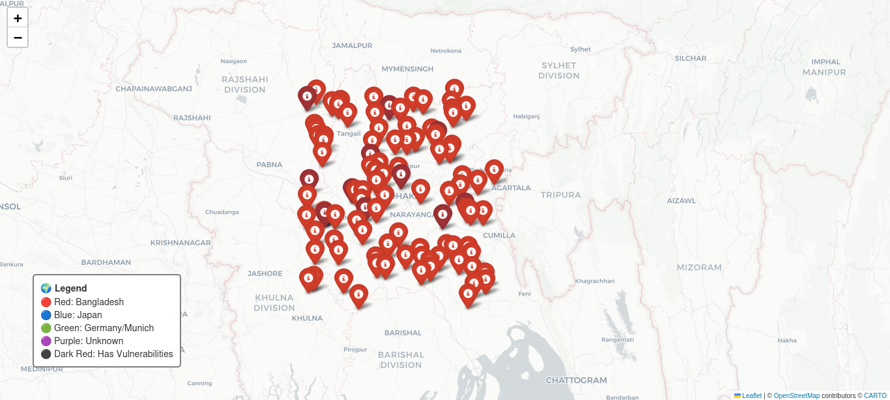

# 💥 WhyNot-StadtNuke

**Because sometimes you just want to nuke a city – politely.**

[](https://www.python.org/downloads/)
[](https://opensource.org/licenses/MIT)
[](https://github.com/ellerbrock/open-source-badges/)

> A **worldwide** network census tool that uses Shodan's free InternetDB API to discover internet-connected devices in any country, generate interactive maps, and produce sarcastic security reports.

---

## 🎯 Why This Exists

Most network scanners are boring, expensive, or both. WhyNot-StadtNuke is none of those.

| Feature | WhyNot-StadtNuke | Others |
|---------|------------------|--------|
| **Cost** | $0 (free APIs only) | $$$ API keys |
| **Rate Limits** | None (InternetDB) | Strict (100-1000 results/month) |
| **Worldwide** | Any country | Limited to paid tiers |
| **Sarcasm** | ✅ Built-in | ❌ Too serious |

---

## ✨ Features

| Feature | Description |
|---------|-------------|
| 🌍 **Worldwide Scanning** | Scan any country: `--country "Bangladesh"`, `--country "Japan"` |
| 🏢 **ISP/ASN Scanning** | Scan specific providers: `--asn "AS45609"` |
| 🗺️ **Interactive Maps** | Single-country OR global merged map |
| 🟢 **Color-Coded** | Green = safe, Red = vulnerabilities, Purple = approximate |
| 🤖 **Sarcastic Report** | Terminal output that roasts network security |
| 🔗 **Shodan InternetDB** | Unlimited free queries, no API key needed |
| ⏰ **GitHub Actions Ready** | Auto-scan daily for free |

---

## 📸 Demo

### Single Country Map (Bangladesh)


### Worldwide Merged Map


*All devices from Bangladesh, Japan, Germany, and more on ONE map.*

---

## 🚀 Quick Start

### Prerequisites
- Python 3.9+
- Kali Linux / Ubuntu / Debian (any distro works)

### Installation

```bash
git clone https://github.com/Abdullah-Al-Raju/WhyNot-StadtNuke.git
cd WhyNot-StadtNuke
python3 -m venv venv
source venv/bin/activate
pip install requests folium
Usage Examples
1. Scan a whole country
bash
python stadtnuke_worldwide.py --country "Bangladesh"
python map_worldwide.py --json Country_Bangladesh_worldwide.json --country "Bangladesh"
firefox bangladesh_worldwide_map.html
2. Scan by ISP (ASN)
bash
python stadtnuke_worldwide.py --asn "AS45609"   # Grameenphone Bangladesh
3. Merge ALL scans into ONE global map
bash
python merge_all_maps.py
firefox GLOBAL_STADTNUKE_MAP.html
4. Original city scanner (Munich demo)
bash
python stadtnuke.py
python make_map.py
firefox Munich_stadtnuke_map.html
Example Output (Bangladesh scan)
text
💥 WhyNot-StadtNuke WORLDWIDE – scanning Country: Bangladesh...
[*] Looking up IP ranges for country: Bangladesh...
    Found range: 103.15.244.0/22
    Found range: 114.130.0.0/16
[*] Scanning 103.15.244.0/22...
   Found 12 devices

==================================================
📢 WhyNot-StadtNuke REPORT for Country: Bangladesh
   Devices found: 47
   Vulnerable devices: 3
   ✅ Scan complete. Not terrible.
==================================================
🗺️ How It Works
text
User Input (--country "Bangladesh")
         ↓
RIPE Stat API → Returns all IP ranges for Bangladesh
         ↓
InternetDB (Shodan) → Queries each IP for ports & vulnerabilities
         ↓
JSON Output + Sarcastic Report
         ↓
Folium Map → Interactive HTML map
         ↓
Global Merger → Combines all countries into one world map
APIs Used (100% Free)
API	Purpose	Cost
InternetDB	Ports, vulnerabilities, hostnames	$0, no key
RIPE Stat	Country → IP ranges	$0, no key
ip-api.com	IP geolocation	$0, 45 req/min
Nominatim	Country coordinates	$0, rate-limited
🌍 Supported Countries (Any country works!)
The tool automatically fetches IP ranges for any country via RIPE Stat API:

bash
python stadtnuke_worldwide.py --country "Japan"
python stadtnuke_worldwide.py --country "India"
python stadtnuke_worldwide.py --country "Germany"
python stadtnuke_worldwide.py --country "Brazil"
python stadtnuke_worldwide.py --country "Australia"
If a country has no ranges in RIPE, the tool falls back to test ranges and prompts you to add ranges manually via city_ranges.json.

📁 Project Structure
text
WhyNot-StadtNuke/
├── stadtnuke.py              # Original city scanner (Munich demo)
├── stadtnuke_ultimate.py     # City scanner with city_ranges.json
├── stadtnuke_worldwide.py    # 🌍 WORLDWIDE – scan any country/ASN
├── make_map.py               # Map for Munich demo
├── make_map_ultimate.py      # Map for city scans
├── map_worldwide.py          # Map for country scans
├── merge_all_maps.py         # 🌍 GLOBAL MAP – merge everything
├── city_ranges.json          # Manual ranges for cities (contributions welcome)
├── README.md                 # This file
├── LICENSE                   # MIT License
├── .gitignore                # Ignore venv, caches
├── screenshot.png            # Demo: Bangladesh map
└── screenshot-worldwide.png  # Demo: Global merged map
🤝 Contributing
Want to add IP ranges for your city? Edit city_ranges.json and submit a pull request:

json
{
  "Munich": ["129.187.0.0/16"],
  "YourCity": ["1.2.3.0/24", "4.5.6.0/24"]
}
🧠 Why "StadtNuke"?
Stadt = German for city (respect for Ausbildung target country)

Nuke = Overkill is underrated

WhyNot‑ = Humble confidence. Why not build a city nuke on a Tuesday?

📜 License
MIT – Do whatever you want. Just keep the sarcasm intact.

👤 Author
Abdullah Al Raju (Raju) – Aspiring network engineer / SOC analyst
Building extreme tools for a German Ausbildung.

https://img.shields.io/badge/GitHub-WhyNot--StadtNuke-black

🙏 Acknowledgements
Shodan InternetDB – Unlimited free IP data

RIPE Stat – Country to IP range mapping

ip-api.com – Free geolocation

Folium – Leaflet maps in Python

Nominatim – OpenStreetMap geocoding

⭐ Star this repo if you want to nuke your own country.
