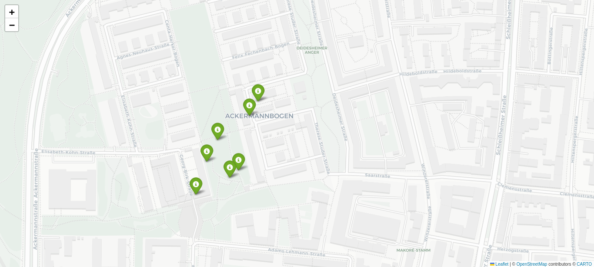

# 💥 WhyNot-StadtNuke

**Because sometimes you just want to nuke a city – politely.**

[](https://www.python.org/downloads/)
[](https://opensource.org/licenses/MIT)
[](https://github.com/ellerbrock/open-source-badges/)

> A city‑wide network census tool that uses Shodan's free InternetDB API to discover every visible device in a city, geolocates them, and produces an interactive map with a sarcastic report.

## 🎯 Why This Exists

Most network scanners are boring. WhyNot-StadtNuke is not.

- **Zero budget** – Uses only free APIs (InternetDB, ip-api.com)
- **Zero permissions needed** – Only scans publicly visible devices
- **100% sarcasm** – Built‑in roast of your city's network security

## ✨ Features

| Feature | Description |
|---------|-------------|
| 🔍 **City Census** | Scans IP ranges of any city for internet‑connected devices |
| 🗺️ **Interactive Map** | Generates an HTML map with real geolocation (or city‑center fallback) |
| 🟢 **Color‑Coded** | Green = safe, Red = has vulnerabilities, Purple = approximate location |
| 🤖 **Sarcastic Report** | Terminal output that roasts your city's security posture |
| ⏰ **Auto‑Scan** | GitHub Actions workflow runs daily for free |
| 🌍 **Worldwide Ready** | Works with any city (just add IP ranges) |

## 📸 Demo



*Live map output from scanning Munich – each marker is an internet-connected device.*

## 🚀 Quick Start

### Prerequisites
- Python 3.9+
- Kali Linux / Ubuntu / Debian (works on any distro)

### Installation

```bash
git clone https://github.com/YOUR_USERNAME/WhyNot-StadtNuke.git
cd WhyNot-StadtNuke
python3 -m venv venv
source venv/bin/activate
pip install requests folium
Usage
bash
# Step 1: Scan a city (edit CITY_NAME in stadtnuke.py first)
python stadtnuke.py

# Step 2: Generate the map
python make_map.py

# Step 3: Open the map
firefox *_stadtnuke_map.html
Example Output (Munich)
text
💥 WhyNot-StadtNuke – nuking Munich...
[*] Scanning 129.187.0.0/16...
   Found 7 devices

==================================================
📢 WhyNot-StadtNuke REPORT for Munich
   Devices found: 7
   Vulnerable devices: 0
   ✅ Not terrible. Still, lock your doors.
   💡 Send this to your city's IT department. Anonymously.
==================================================
🗺️ How It Works
stadtnuke.py – Queries InternetDB for each IP in a given range

make_map.py – Geocodes IPs via ip-api.com (free, 45 req/min)

folium – Creates an interactive Leaflet map

GitHub Actions – Runs daily and saves JSON + HTML as artifacts

🌍 Making It Worldwide
Currently, IP ranges are hardcoded for Munich, Berlin, Mumbai, etc.
To scan your city:

Find IP ranges using whois or RIPE/ARIN databases

Add them to CITY_RANGES in stadtnuke.py

Run the scanner

Pull requests for more city ranges are welcome!

🧠 Why "StadtNuke"?
Stadt = German for city (respect for the target country)

Nuke = Overkill is underrated

WhyNot‑ = Humble confidence. Why not build a city nuke on a Tuesday?

📜 License
MIT – Do whatever you want. Just keep the sarcasm intact.

👤 Author
Raju

🙏 Acknowledgements
InternetDB – Free Shodan data

ip-api.com – Free geolocation (no key required)

Folium – Leaflet maps in Python

Star this repo if you want to nuke your own city. ⭐
